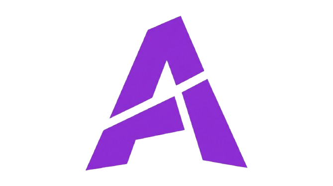

<div align="center">
  
  <h1>✨ Astra Client Web (Archived) ✨</h1>
  <p><b>The official web portal and archive for Astra Client.</b></p>
  
  <p>
    <a href="https://github.com/viyomog/AstraClient-Web"></a>
    <a href="https://github.com/viyomog/AstraClient-Web/stargazers"></a>
    <a href="https://github.com/viyomog/AstraClient-Web/blob/main/LICENSE"></a>
  </p>

  <br />
</div>

> [!NOTE]
> **Project Status: Officially Discontinued (2026)**  
> After an incredible journey, development and updates for Astra Client have ceased. This repository hosts the official archive website preserving the project's history, feature showcase, benchmark telemetry, and documentation.

---

## 🌌 Overview

**Astra Client Web** is the official archive and showcase website for Astra Client—a hyper-optimized, feature-rich Minecraft client engineered for maximum performance, clean aesthetics, and professional standards.

This web application serves as a permanent public record of the client's architecture, release performance telemetry, and development milestones.

---

## 🚀 Key Project Features

During its development, Astra Client delivered:

* **⚡ Hyper-Optimized Rendering**: Custom JVM configurations and memory tuning to deliver stable frametimes and higher FPS.
* **🤖 Astra AI Integration**: In-launcher artificial intelligence companion for recipe lookups, building advice, and instant Minecraft knowledge.
* **🎮 Distraction-Free Play Interface**: Polished, dark glassmorphism dashboard providing world and server access with single-click navigation.
* **⚙️ Modern Settings Engine**: Complete overhaul of standard configuration menus, offering fine-grained control over visuals, performance, and scaling.
* **📦 Native Mod Management**: Built-in module and mod handling engineered directly into the client ecosystem.
* **👤 Seamless Multi-Account Management**: Effortless switching between Microsoft and Mojang profiles with secure authentication.
* **📊 Final Release Telemetry**: Publicly verified performance benchmarks under extreme stress-test environments (Mega Lobby, High-End Shaders, Anarchy entity spam).

---

## 🛠️ Tech Stack

This website is built with modern web technologies:

* **Core Framework**: [React 19](https://react.dev/)
* **Build System & Dev Server**: [Vite 7](https://vitejs.dev/)
* **Routing**: [React Router 7](https://reactrouter.com/)
* **Animations**: [Framer Motion 12](https://www.framer.com/motion/)
* **Iconography**: [Lucide React](https://lucide.dev/)
* **Styling**: Vanilla CSS (Tailored HSL design system, responsive grids, and CSS glassmorphism)
* **Analytics**: [@vercel/analytics](https://vercel.com/analytics) & [@vercel/speed-insights](https://vercel.com/docs/speed-insights)

---

## 💻 Getting Started Locally

### Prerequisites

* [Node.js](https://nodejs.org/) (version 18 or higher recommended)
* `npm` or `yarn`

### Setup Instructions

1. **Clone the repository:**
   ```bash
   git clone https://github.com/viyomog/AstraClient-Web.git
   cd AstraClient-Web
   ```

2. **Install project dependencies:**
   ```bash
   npm install
   ```

3. **Start the local development server:**
   ```bash
   npm run dev
   ```
   Open your browser and navigate to `http://localhost:5173/`.

4. **Build for production:**
   ```bash
   npm run build
   ```

5. **Preview the production build:**
   ```bash
   npm run preview
   ```

---

## 📁 Repository Structure

```text
AstraClient-Web/
├── public/                 # Static public assets (favicon, logos)
├── src/
│   ├── assets/             # Images, feature screenshots, and branding
│   ├── components/         # Reusable UI components
│   │   ├── Navbar.jsx      # Navigation bar with archive badge
│   │   ├── Hero.jsx        # Discontinuation notice and hero showcase
│   │   ├── Features.jsx    # Feature cards and overview
│   │   ├── Footer.jsx      # Archived footer and legal notices
│   │   └── DataPrivacy.jsx # Transparency and data usage notice
│   ├── pages/              # Routed pages
│   │   ├── FeaturesPage.jsx   # Detailed feature showcase archive
│   │   ├── BenchmarksPage.jsx # Final release telemetry and charts
│   │   ├── TeamPage.jsx       # Project contributors and team roster
│   │   ├── FaqPage.jsx        # Project status and discontinuation FAQs
│   │   ├── ContactPage.jsx    # Inquiry and community archive contact
│   │   ├── DownloadPage.jsx   # Official downloads closed notification
│   │   ├── PrivacyPage.jsx    # Archived privacy policy
│   │   └── TermsPage.jsx      # Archived terms of service
│   ├── App.jsx             # Main router configuration
│   ├── index.css           # Global design system, tokens, and utilities
│   └── main.jsx            # Application entry point
├── index.html              # HTML entry file
├── package.json            # Project dependencies and scripts
└── vite.config.js          # Vite configuration
```

---

## 👥 The Team & Contributors

| [<br><sub><b>Viyom Paliwal</b></sub>](https://github.com/viyomog) | [<br><sub><b>Rajdeep Singh</b></sub>](https://github.com/viyomog) | [<br><sub><b>Dikshit Kumar</b></sub>](https://github.com/otakurush11) | [<br><sub><b>Somay Yadav</b></sub>](https://github.com/viyomog) |
| :---: | :---: | :---: | :---: |
| **Founder & Lead Developer** | **Manager & Creative Lead** | **Software Tester & QA** | **Community Manager** |

---

## 📄 License

This project is licensed under the MIT License - see the [LICENSE](LICENSE) file for details.

---

<div align="center">
  <p><b>Astra Client</b> • Officially Discontinued • 2026</p>
  <p>Crafted with 💜 by the Astra Team</p>
</div>
